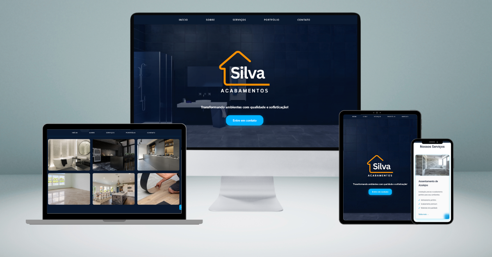

# 🏠 Silva Acabamentos - Projeto Web

> "Transformando ambientes com qualidade e sofisticação!"

Site institucional para a empresa Silva Acabamentos, onde transformamos a paixão por acabamentos perfeitos em uma presença digital incrível. O site nasceu da necessidade de criar uma presença digital profissional e atrativa para o negócio, mostrando a qualidade do trabalho do proprietário "Vinicius Silva" e facilitando o contato com novos clientes.



## 🚀 Tecnologias Utilizadas

- HTML5 (Semântico e otimizado)
- CSS3 (Flexbox e Grid)
- JavaScript (Vanilla ES6+)
- EmailJS para formulários
- Responsive Design
- Mobile First Approach

## ⚙️ Funcionalidades Principais

- **Menu Inteligente**: Menu responsivo com animações suaves
- **Hero Section**: Video background com overlay profissional
- **Portfólio Interativo**: Galeria com filtros por categoria
- **Formulário de Contato**: Integração com EmailJS
- **Navegação Suave**: Smooth scroll e animações otimizadas
- **Layout Responsivo**: Adaptação perfeita para todos os dispositivos
- **Back to Top**: Botão flutuante animado

## 🎨 Design e Identidade Visual

### Cores Principais
- Azul Principal: `#00B2FF`
- Azul Secundário: `#0088CC`
- Fundo Escuro: `#0A192F`
- Texto Claro: `#E6E6E6`

### Tipografia
- Font-family: 'Segoe UI', sans-serif
- Pesos: 400, 500, 600, 700

## 📱 Breakpoints de Responsividade

- Desktop Grande: 1400px+
- Desktop: 1200px
- Tablet Grande: 992px
- Tablet: 768px
- Mobile: 576px
- Mobile Pequeno: 380px

## 🔧 Estrutura do Projeto

```
silva-acabamentos/
├── assets/
│   ├── css/
│   │   ├── style.css
│   │   └── responsive.css
│   ├── js/
│   │   └── script.js
│   ├── img/
│   └── video/
├── index.html
└── README.md
```

## ⚡ Performance & Otimizações

- Lazy loading de imagens
- Compressão de assets
- Minificação de CSS/JS
- Cache otimizado
- Carregamento assíncrono

## 🔒 SEO & Acessibilidade

- Meta tags otimizadas
- Estrutura semântica
- ARIA labels
- Alt texts descritivos
- Contraste adequado
- Navegação via teclado

## 💼 Benefícios Para o Cliente

### 🎯 Mais Conversão
- CTAs estrategicamente posicionados
- Formulário otimizado
- WhatsApp integrado
- Portfolio persuasivo

### 💎 Mais Profissionalismo
- Design premium
- Navegação intuitiva
- Informações organizadas
- Visual confiável

### 📱 Mais Alcance
- Responsivo em todos os dispositivos
- Carregamento otimizado
- SEO preparado
- Compartilhável em redes sociais

## 🚀 Próximos Passos

### Curto Prazo
- Blog com dicas de decoração
- Área de cliente exclusiva
- Galeria 360° de projetos
- Sistema de agendamento online

### Médio Prazo
- Analytics avançado
- Integração com CRM
- Chat ao vivo
- Área administrativa

## 💡 Conclusão

Este projeto não é apenas um site, mas uma ferramenta completa de transformação digital para a Silva Acabamentos, conectando profissionalismo e tecnologia para criar uma presença online memorável.

---

*"Porque sua presença digital merece um acabamento tão perfeito quanto seus projetos!"*

## 📜 Licença

Este projeto está sob a licença MIT. Veja o arquivo `LICENSE` para mais detalhes.